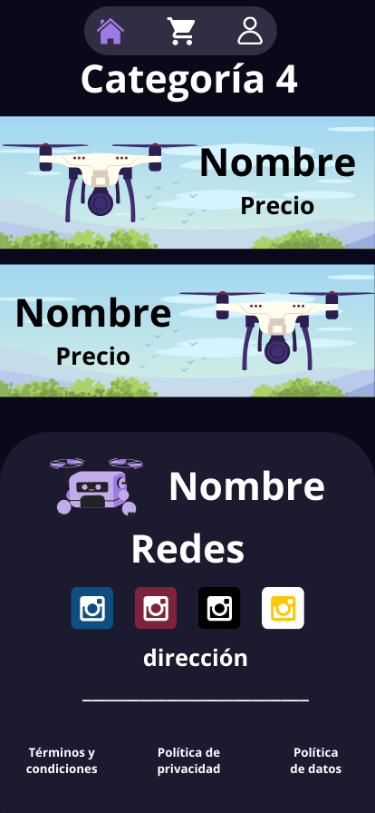
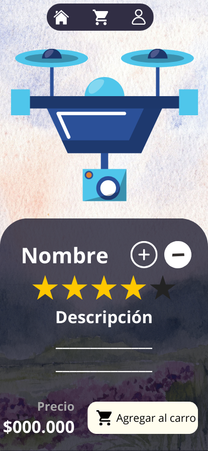
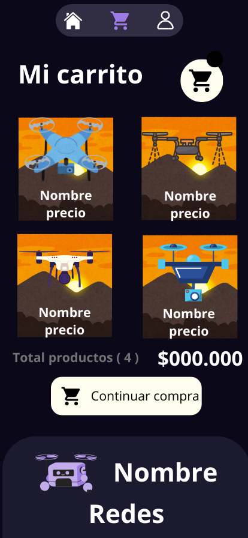
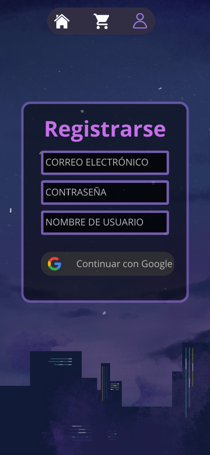

## Table of Contents
1. [General Info](#general-info)
2. [Project status](#status)
3. [explanation](#explanation)
4. [Technologies](#Technologies)
5. [Bugs](#bugs)

### General Info
***
This is a project to create an e-commerce website focused on drones, the pages are designed exclusively for mobile devices,focused on the sale of drones of different categories and prices.
### Status
The **principal structure** of the project is **finished**, except for adding some extra pages, such as a section where data is requested to make the purchase, and a section where once registered, the profile data and configurations appear, apart from that, the layout is finished, although it is not functional because at the moment *javascript has not been implemented* to make it functional, but it is planned to implement it in the future.
### Explanation
***
**Design and explanation**
***

## Technologies
***
A list of technologies used within the project:
* [HTML]
* [CSS]
* [Visual_Studio_Code]
## installation
***
To follow a proper continuity order although not necessary, you should first open the html file called *index.html* either with the *Live Server* extension of *visual studio code* or by running the *.html file.*

## bugs
***
Its a feature not a bug, but since it is a page intended for mobile, if you want to view the page correctly and not the message to test on mobile, you can open it in a computer browser, but setting the mobile mode in the inspect section
